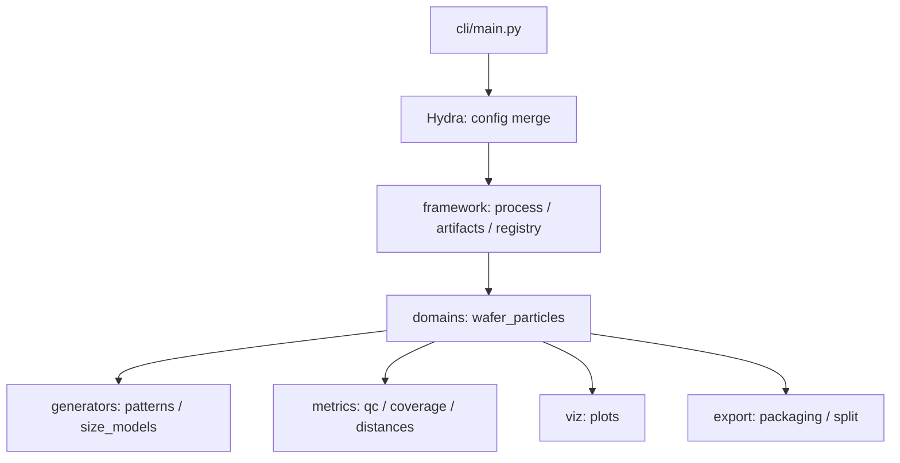

# Architecture

このドキュメントは、SynthLab Scaffold（wafer_particles）の **依存方向・責務分割・不変条件**を、レビュー/拡張開発者向けにまとめます。

---

## 1. 設計ゴール

| ゴール | 具体化 |
|---|---|
| パターン増加でコードが肥大化しない | `if/else` で分岐を増やさず、Pattern/SizeModel/Metric を **プラグイン**として追加する |
| 設定が真実で再現可能 | Hydraで合成した `resolved.yaml` を必ずrunに保存し、実験条件を追跡可能にする |
| データ品質をゲートで担保 | `doctor`（実行前）+ `qc`（実行後）+ `tests`（変更時）で破綻を止める |
| ラベル粒度を運用可能に | fineラベル（見た目）と原因/カテゴリ（macro等）を混同しない。外部specで後付け可能にする |
| 将来のドメイン拡張 | `domains/` を増やしても `framework/` を壊さないよう **依存方向**を固定する |

---

## 2. レイヤ構造と依存方向

### 2.1 全体像（依存方向）

### 2.2 依存方向ルール（必須）

| ルール | 理由 | 破ると起きること |
|---|---|---|
| `framework/` は `domains/` に依存しない | ドメイン追加のたびに基盤が壊れないように | domain増加で基盤が分岐地獄になる |
| `domains/` は CLI/Hydra に依存しない（設定は引数として受け取る） | ドメインをテストしやすくする | テストが困難・再利用不能 |
| 生成の乱数は `seed`→`RNG` から派生（決定論） | 再現性・比較可能性 | “同じ設定なのに違う結果”が発生 |
| run成果物は immutable（追記ではなく新run） | トレーサビリティ | 誰がいつ書き換えたか不明になる |

---

## 3. コア概念（契約）

### 3.1 Process（処理単位）

Processは「入出力契約」を持つ実行単位です（例: generate / qc / export）。

| Process | 入力 | 出力 | 目的 |
|---|---|---|---|
| doctor | config | PASS/FAIL | 設定破綻を実行前に止める |
| generate | config | particles/samples + meta | 疑似データ生成 |
| qc | run | reports | 統計・特徴量で品質を可視化 |
| export | run | data + splits + card | ML向け配布 |

> Process追加は `framework` のディスパッチと `domains` の実装をセットで行います（developer_guide参照）。

### 3.2 Pattern（付着分布プラグイン）

Patternは「粒子の **座標分布**」を生成するプラグインです。

- **入力**: waferサイズ、粒子数、パターン固有パラメータ、RNG
- **出力**: 粒子の `r_mm, theta_rad`（+ 必要なら内部メタ）

Pattern固有パラメータは、固定値だけでなく **param_space（分布指定）**でサンプルごとに振れる設計とします。

### 3.3 SizeModel（粒径分布プラグイン）

SizeModelは「粒子の **サイズ分布**」を生成するプラグインです。

- **per_sample**: サンプル（ウェハ）ごとに分布パラメータをサンプルして固定する（推奨）
- **selection（mix）**: データセット内で複数の分布モデルを混在させる（異常検出・拡張に有用）
- **clamp**: `min_um/max_um` による物理/計測範囲制約（必須）

---

## 4. 不変条件（Invariants）

### 4.1 Determinism（決定論）
同じ `resolved.yaml` と `seed` で実行した結果は、同一の `particles/samples` になるべきです。

チェック方法（例）:
- `pytest` に決定論テストを置く
- 生成物のハッシュ（行順含む/含まない）を比較する

### 4.2 Wafer内制約
全粒子は wafer 半径内に収まる必要があります。

- `r_mm ∈ [0, wafer_radius_mm]`
- 角度は定義域（例: `[0, 2π)`）に正規化する

### 4.3 No leakage（リーク禁止）
ML用 split は **sample_id単位**で行う。

- 粒子単位で split すると、同一ウェハ由来粒子が train/test に跨りリークする

### 4.4 Label contracts（ラベル契約）
- fineラベル（生成時の見た目）と、macro/原因仮説は別物
- macro等は外部specで後付けでき、生成コードを変えずに運用粒度を調整できる

---

## 5. 代表的な拡張ポイント

| 拡張したいもの | 追加する場所 | 追加後に必ずやること |
|---|---|---|
| 新しいPattern | `domains/wafer_particles/generators/patterns/` + `conf/wafer_particles/patterns/` | doctorルール・pytest・docs更新 |
| 新しいSizeModel | `domains/wafer_particles/generators/size_models/` + `conf/wafer_particles/size_models/` | clamp・per_sample記録・pytest |
| 新しいMetric/QC | `domains/wafer_particles/metrics/` | report出力契約・pytest |
| 新しいProcess | `framework/process.py` + `domains/wafer_particles/processes/`（構成はrepoに合わせる） | IO契約・docs更新・smoke config |

詳細手順は developer_guide.md を参照してください。
