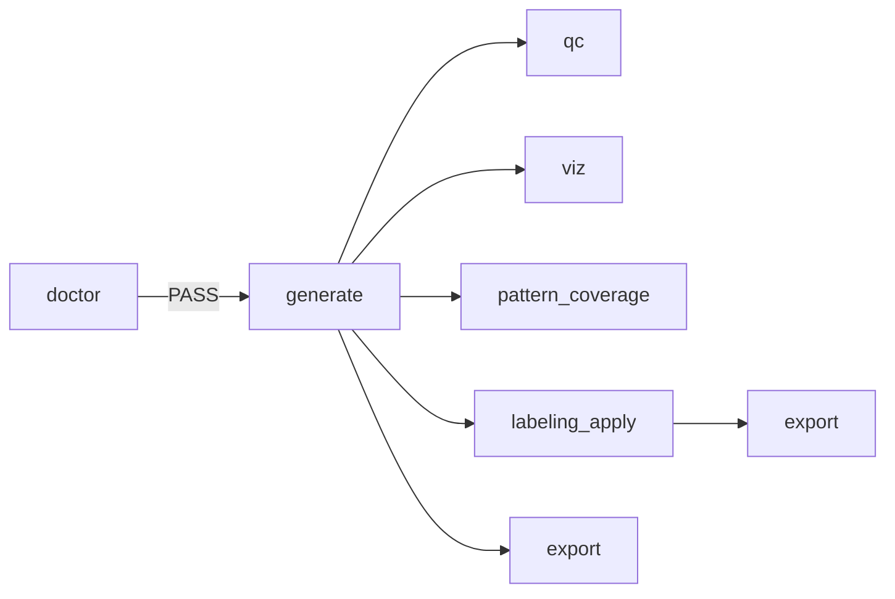

# Process Catalog

ここでは `process=` ごとの **I/O契約**・代表コマンド・成果物を整理します。

---

## 1. 全体フロー



---

## 2. Process一覧

| process | 目的 | 入力 | 出力（主） | 失敗しやすい点 |
|---|---|---|---|---|
| doctor | 設定検証 | config | PASS/FAIL | 単位ミス、範囲逆転、未定義dist |
| generate | 生成 | config | `particles`, `samples`, `meta` | 粒子数が大きすぎ、wafer外座標 |
| qc | 統計/特徴量 | run | `reports/` | schema不一致、size列単位 |
| viz | 可視化 | run | `plots/` | 点数が多すぎて重い |
| pattern_coverage | 網羅性 | run | coverage json/csv | multi-labelの解釈 |
| labeling_apply | 多層ラベル | dataset + spec | label列追加 | specの不整合（UNKNOWN） |
| compose | 合成 | 既存run(s) | 合成run | sample_id衝突、追跡列 |
| export | 配布 | dataset run | csv/parquet + splits | splitリーク、層化の設定 |

---

## 3. コマンド例

### 3.1 doctor
```bash
python -m synthlab.cli.main process=doctor seed=1
```

### 3.2 generate（ベンチ）
```bash
python -m synthlab.cli.main \
  --config-path conf/benchmarks/wafer_particles \
  --config-name benchmark_macro10_300mm_1k_generate_size_models_mix_param_sweep_v1 \
  seed=42
```

### 3.3 qc
```bash
python -m synthlab.cli.main \
  process=qc seed=1 \
  input_dir="runs/<GENERATE_RUN_DIR>"
```

### 3.4 labeling_apply
```bash
python -m synthlab.cli.main \
  process=labeling_apply seed=1 \
  input_dir="runs/<GENERATE_OR_EXPORT_RUN_DIR>" \
  wafer_particles.labeling.spec_path="conf/wafer_particles/labeling/benchmark_macro10.yaml"
```

### 3.5 export（CSV + split 8:1:1）
```bash
python -m synthlab.cli.main \
  process=export seed=0 \
  wafer_particles.export.input_dir="runs/<LABELED_OR_GENERATE_RUN_DIR>" \
  wafer_particles.export.format=csv \
  wafer_particles.export.split.mode=ratio \
  wafer_particles.export.split.ratios.train=8 \
  wafer_particles.export.split.ratios.val=1 \
  wafer_particles.export.split.ratios.test=1
```

### 3.6 compose（2枚重ね合わせ）
```bash
python -m synthlab.cli.main \
  process=compose seed=123 \
  input_dir="runs/<GENERATE_RUN_DIR>" \
  compose.n_components=2 \
  compose.n_samples_out=100
```

---

## 4. 成果物（ざっくり）

| プロセス | 代表出力 | 内容 |
|---|---|---|
| generate | `data/particles.*`, `data/samples.*` | 粒子/サンプルテーブル |
| qc | `reports/size_stats.*`, `reports/qc_stats.*` | 統計・特徴量 |
| pattern_coverage | `reports/coverage.*` | ラベル偏り/欠落 |
| export | `data/*`, `splits/*`, `meta/dataset_card.md` | 配布用パッケージ |

> 正確なファイル名・パスは実装を真実として、artifact契約（artifacts.md）で管理します。
